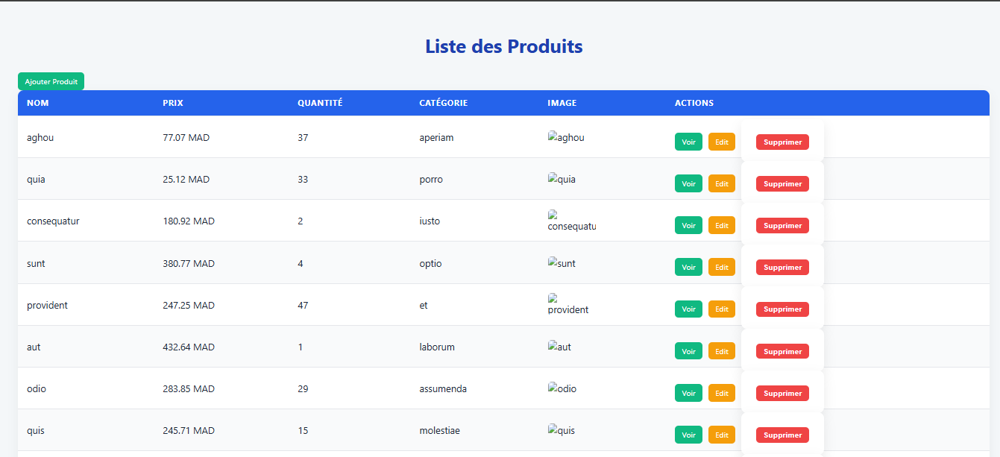

# Laravel CRUD Produits avec Catégories
---
****


## Description
Cette application Laravel permet de gérer des **produits** et leurs **catégories**.  
Fonctionnalités principales :  
- CRUD complet pour les produits (Create, Read, Update, Delete)  
- Gestion des catégories (One-to-Many)  
- Sélection de la catégorie lors de la création ou modification d’un produit  
- Affichage du produit avec sa catégorie et image  
- Interface moderne avec CSS responsive  

---

## Installation
---
1. Cloner le projet :  
```bash
git clone <url-du-repo>
```
## Installer les dépendances :
```
composer install
npm install
npm run dev
```
## Copier .env.example et créer le fichier .env :
```
cp .env.example .env
```
## Configurer la base de données dans .env :
```
DB_CONNECTION=mysql
DB_HOST=127.0.0.1
DB_PORT=3306
DB_DATABASE=nom_de_la_base
DB_USERNAME=root
DB_PASSWORD=
```
## Générer la clé de l’application :
```
php artisan key:generate
```
## Migrer et remplir la base de données avec les seeders :
```
php artisan migrate:fresh --seed
```
## Lancer le serveur local :
```
php artisan serve
```
